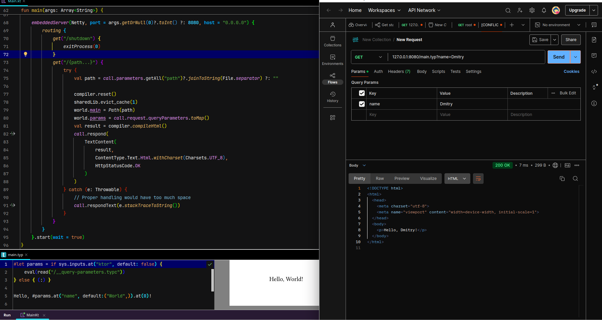
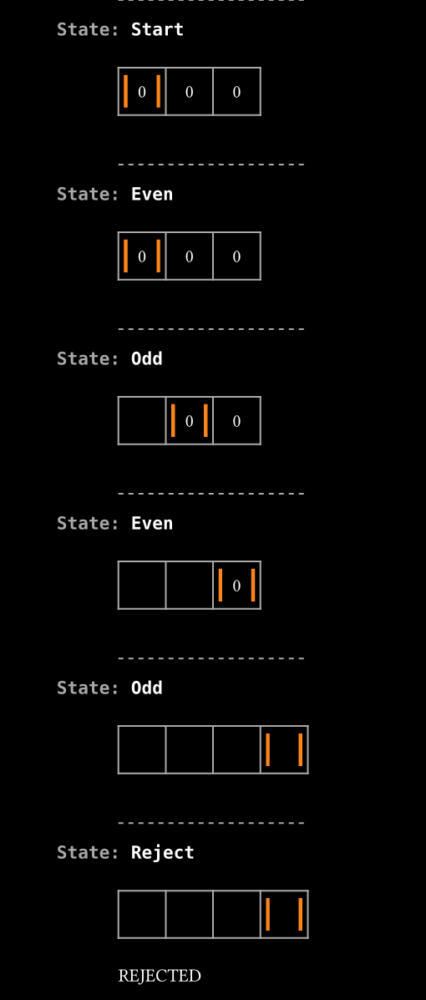

# The Grimoire.

This Book holds arcane code fragments, cryptic symbols, 
potent incantation, spells of automation,charms of efficiency,
and incantations that bend machines to your will.
Within these pages lie the secrets to crafting 
digital artifacts and summoning logic from the void.

Cursed be silence, when the Omnissiah’s word should ring out.

## Speaking seriously...

This repository contains several modules, each of which is some kind of 
proof of concept. Either it's a thing used for an unintended purpose, or 
just in an unexpected way. 

Some of the ~~incantations~~ examples uses my other projects. 
To install those, run `./setup.sh` (you'll also need `cargo` to be installed).

I'll add pdfs or readmes describing what happens as soon as I can.

### Ktor & Typst

Minimalistic example of a webserver that uses Typst for HTML generation. It uses Ktor for webservering, and TyKo for typsting. See [README](ktor-with-typst/README.md).

### Turing Machine in Typst

Quite self-explanatory. See [README](typst-turing-machine/README.md).

### `reinterpret_cast` and Java

Impossible, you say? Ha. Just not as easy. The explanation is in [pdf](reinterpret_cast/reinterpret-cast-and-java.pdf).
